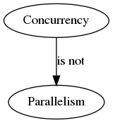
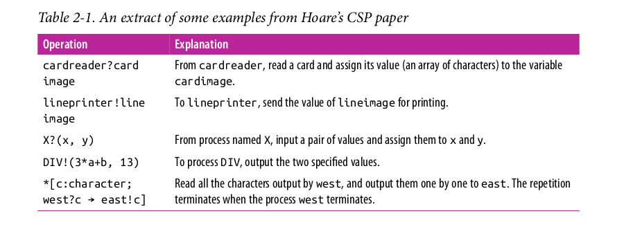
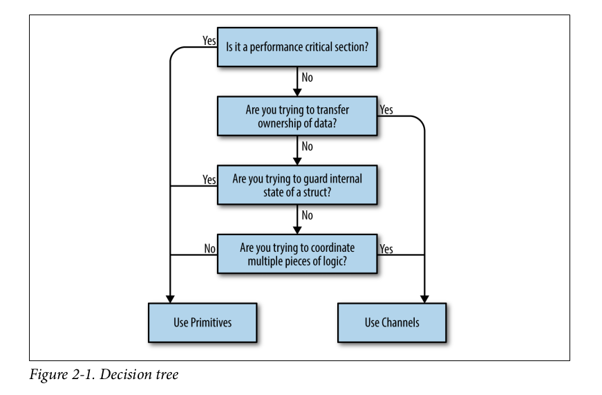
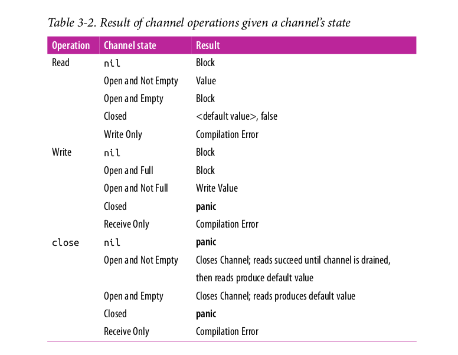

# Notes Concurrency in Go

In six chapters building block, patterns, scaling issues and internals are discussed.

## 1 Intro


It's hard.


### Coffman Conditions

If at least one of the conditions is not true, we can *prevent* deadlocks (but
it's hard to reason about code).

### Livelocks

Busy, no progress (two or more process attempt preventing a deadlock without
coordination). Subset of Starvation.

### Starvation

One or more greedy process. Livelock a special case, since no process makes
progress. Example: polite worker, keep critical section short.

### Is it safe?

Reduce API ambiguity, be explicit or do not expose concurrency at all.

### Simplicity in the Face of Complexity

> with Go’s concurrency primitives, you can more safely and clearly express
your concurrent algorithms.

[Understanding Real-World Concurrency Bugs in
Go](https://songlh.github.io/paper/go-study.pdf) suggested otherwise, no?


## 2 Modeling

### Concurrency != Parallelism



> Concurrency is a property of the code; parallelism is a property of the
> running program.

* code **is** not parallel &mdash; we hope it will **run** in parallel

> If you wanted to write concurrent code, you would model your program in terms
> of threads and synchronize the access to the memory between them.

### What is CSP?

* 1978
* input and output are overlooked properties of (concurrent) programs
* process calculus



A process requires input to run. Other processed might consume output.

### How does it help?

Goroutines may help shift thinking about *parallelism* to thinking about
*concurrency*.

What would a few questions be, if you would need to implement a web server with
threads?

* language support
* design, thread boundaries
* optimal number for a pool

> If we step back and think about the natural problem, we could state it as such:
individual users are connecting to my endpoint and opening a session.  The
session should field their request and return a response. In Go, we can almost
directly represent the natural state of this problem in code: we would create a
goroutine for each incoming connection, field the request there (potentially
communicating with other goroutines for data/services), and then return from
the goroutine's function. How we naturally think about the problem maps
directly to the natural way to code things in Go.

Side effect, separation of concerns.

> A more natural mapping to the problem space is an enormous benefit, but it
> has a few beneficial side effects as well. Go's runtime multiplexes
> goroutines onto OS threads automatically and manages their scheduling for us.
> This means that optimizations to the runtime can be made without us having to
> change how we’ve modeled our prob‐ lem; this is classic separation of
> concerns.

More composable.

> Channels, for instance, are inherently composable with other channels. This
> makes writing large systems simpler because you can coordinate the input from
> multiple subsystems by easily composing the output together. You can combine
> input channels with timeouts, cancellations, or messages to other subsystems.
> Coordinating mutexes is a much more difficult proposition.

The `select` statement help composition.

### Go Approach

* support CSP and classic style (locks, pool, ...)

[So which should you use?](https://github.com/golang/go/wiki/MutexOrChannel)

> Use whichever is most expressive and/or most simple.



Thread-safe, transparent to the caller.

```go
type Counter struct {
	mu    sync.Mutex
	value int
}

func (c *Counter) Increment() {
	c.mu.Lock()
	defer c.mu.Unlock()
	c.value++
}
```

Performance.

> This is because channels use memory access synchronization to operate,
> therefore they can only be slower.

## 3 Building blocks

### Goroutines

* always at least one present

> They're not OS threads, and they're not exactly green threads—threads that
> are managed by a language's runtime - they're a higher level of abstraction
> known as coroutines. Coroutines are simply concurrent subroutines (functions,
> closures, or methods in Go) that are nonpreemptive - that is, they cannot be
> interrupted.

> Goroutines don't define their own suspension or reentry points; Go's runtime
> observes the runtime behavior of goroutines and automatically suspends them
> when they block and then resumes them when they become unblocked.

> In a way this makes them preemptable, but only at points where the goroutine
> has become blocked.

Meet the host.

> Go's mechanism for hosting goroutines is an implementation of what's called
> an M:N scheduler.

Map M green threads onto N OS threads. Goroutines are scheduled onto green
threads. It's a *fork-join* model, at any point you can start a goroutine and
they may join again later - through some synchronisation (e.g. a WaitGroup).

#### Pop quiz

* `hello` or `welcome` - which one is it?

```go
var wg sync.WaitGroup
salutation := "hello"
wg.Add(1)
go func() {
	defer wg.Done()
	salutation = "welcome"
}()
wg.Wait()
fmt.Println(salutation)
```

Next one is a bit trickier.

```go
var wg sync.WaitGroup
for _, salutation := range []string{"hello", "greetings", "good day"} {
    wg.Add(1)
    go func() {
        defer wg.Done()
        fmt.Println(salutation)
    }()
}
wg.Wait()
```

* loop might exit, before the goroutines start
* GC won't pickup `salutation` because it is still referenced
* solution: pass value as argument to goroutine

Core idea: Goroutines run in the same address space.

<!-- TODO: write program that let's the GR's stack explode -->

#### Size of a Goroutine

In the book: `2.817kb`, on my machine `0.007kb`.

* also: [NumGoroutine](https://golang.org/pkg/runtime/#NumGoroutine)

Also: context switch overhead, but much better in software than on OS level.

```shell
$ sudo apt install linux-tools-generic linux-tools-5.0.0-29-generic \
    linux-cloud-tools-5.0.0-29-generic linux-cloud-tools-generic \
    perf-tools-unstable
```

Result from a `perf` test:

```
$ taskset -c 0 perf bench sched pipe -T
# Running 'sched/pipe' benchmark:
# Executed 1000000 pipe operations between two threads

     Total time: 6.158 [sec]

       6.158190 usecs/op
         162385 ops/sec
```

> This benchmark actually measures the time it takes to send and receive a
> message on a thread, so we'll take the result and divide it by two.

So: 3us per CSW or 300k CSW/s at most. As I am writing this, ~ 2000 CSW/s.

```shell
$ make
go test -bench=. -cpu=1
goos: linux
goarch: amd64
pkg: github.com/miku/cignotes/x/csw
BenchmarkContextSwitch   6272942               191 ns/op
PASS
ok      github.com/miku/cignotes/x/csw  2.332s
```

* 191ns per CSW, much better.


### Package sync

#### The WaitGroup


> WaitGroup is a great way to wait for a set of concurrent operations to >
> complete when you either don't care about the result of the concurrent
> operation, or you have other means of collecting their results.

#### Mutex, RWMutex

> A Mutex provides a concurrent-safe way to express exclusive access to these
> shared resources.

* put `Unlock` in `defer`
* minimize critical sections

The RWMutex is more fine grained.

> This means that an arbitrary number of readers can hold a reader lock so long
> as nothing else is holding a writer lock.

#### Cond

> A rendezvous point for goroutines waiting for or announcing the occurrence
of an event.

Inefficient checks for a condition:

```go
for conditionTrue() == false {
}
```

Better:

```go
for conditionTrue() == false {
    time.Sleep(1*time.Millisecond)
}
```

Better:

```go
c := sync.NewCond(&sync.Mutex{})
c.L.Lock()
for conditionTrue() == false {
	c.Wait() // blocked - and goroutine suspended
}
c.L.Unlock()
```

* NewCond takes a `sync.Locker` (interface)
* Wait, Broadcast and Signal

> Internally, the runtime maintains a FIFO list of goroutines waiting to be >
> signaled; Signal finds the goroutine that’s been waiting the longest and
> notifies that, whereas Broadcast sends a signal to all goroutines that are
> waiting. Broadcast is arguably the more interesting of the two methods as it
> provides a way to communicate with multiple goroutines at once.

A GUI example (but which GUI framework).

> To get a feel for what it's like to use Broadcast, let's imagine we're
> creating a GUI application with a button on it. We want to register an
> arbitrary number of functions that will run when that button is clicked. A
> Cond is perfect for this because we can use its Broadcast method to notify
> all registered handlers.

#### Once

Odd function, often used.

```
$ grep -ir sync.Once $(go env GOROOT)/src | wc -l
```

* book: 70, me (Go 1.13): 112

#### Pool

> Pool is a concurrent-safe implementation of the object pool pattern.

> At a high level, a the pool pattern is a way to create and make available a
> fixed number, or pool, of things for use. It's commonly used to constrain
> the creation of things that are expensive (e.g., database connections) so
> that only a fixed number of them are ever created, but an indeterminate
> number of operations can still request access to these things.

```go
myPool := &sync.Pool{
	New: func() interface{} {
		fmt.Println("Creating new instance.")
		return struct{}{}
	},
}
myPool.Get()
instance := myPool.Get()
myPool.Put(instance)
myPool.Get()
```

### Channels

A stream.

> Like a river, a channel serves as a conduit for a stream of information; values may be
passed along the channel, and then read out downstream. For this reason I usually
end my chan variable names with the word "Stream."

I used `done`, `queue` or the `C` suffix, like `outC` or `workC` or the like.

* typed
* unidirectional, bidirectional

```go
invalid operation: <-writeStream
    (receive from send-only type chan<- interface {})

invalid operation: readStream <- struct {} literal
    (send to receive-only type <-chan interface {})
```

The channel receive can return two values.

```go
stringStream := make(chan string)
go func() {
	stringStream <- "Hello channels!"
}()
salutation, ok := <-stringStream
fmt.Printf("(%v): %v", ok, salutation)
```

> The second return value is a way for a read operation to indicate whether the
> read off the channel was a value generated by a write elsewhere in the
> process, or a default value generated from a closed channel.

Channels have states: active or closed.

* `close` makes for a universal sentinel value

It is ok to read from a closed channel (but writing panics).

> This is to allow support for multiple downstream reads from a single upstream
> writer on the channel.

* You can `range` over channels.
* You can create *buffered channels*

> An unbuffered channel has a capacity of zero and so it’s already full before
> any writes. A buffered channel with no receivers and a capacity of four would
> be full after four writes, and block on the fifth write since it has nowhere
> else to place the fifth element. Like unbuffered channels, buffered channels
> are still blocking; the preconditions that the channel be empty or full are
> just different. In this way, buffered channels are an in-memory FIFO queue
> for concurrent processes to communicate over.

* default value for channel: `nil`

Table of channel states and results.




Encapsulation and ownership.

Example:

```go
chanOwner := func() <-chan int {
	resultStream := make(chan int, 5)
	go func() {
		defer close(resultStream)
		for i := 0; i <= 5; i++ {
			resultStream <- i
		}
	}()
	return resultStream
}
resultStream := chanOwner()
for result := range resultStream {
	fmt.Printf("Received: %d\n", result)
}
fmt.Println("Done receiving!")
```

> Notice how the lifecycle of the resultStream channel is encapsulated within
> the chan Owner function. It's very clear that the writes will not happen on a
> nil or closed channel, and that the close will always happen once.


### The select statement

> If channels are the glue that binds goroutines together, what does that say
> about the select statement? It is not an overstatement to say that select
> statements are one of the most crucial things in a Go program with
> concurrency.

Multiple cases may be available.

```go
c1 := make(chan interface{})
close(c1)
c2 := make(chan interface{})
close(c2)
var c1Count, c2Count int
for i := 1000; i >= 0; i-- {
	select {
	case <-c1:
		c1Count++
	case <-c2:
		c2Count++
	}
}
fmt.Printf("c1Count: %d\nc2Count: %d\n", c1Count, c2Count)
// c1Count: 505
// c2Count: 496
```

Why random?

> A good way to do that is to introduce a random variable into your equa‐
> tion—in this case, which channel to select from. By weighting the chance of
> each channel being utilized equally, all Go programs that utilize the select
> statement will perform well in the average case.

What is no channel is ready? You can use a timeout *channel*.

```go
func main() {
    var c <-chan int
    select {
    case <-c:
    case <-time.After(1 * time.Second):
        fmt.Println("Timed out.")
    }
}
```

Finally, there is a `default` clause.


### GOMAXPROCS

###

## 4 Patterns

## 5 Scale

## 6 Internals


