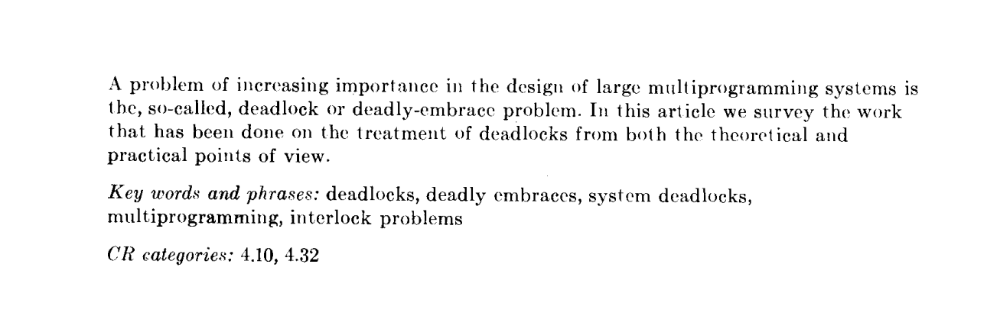
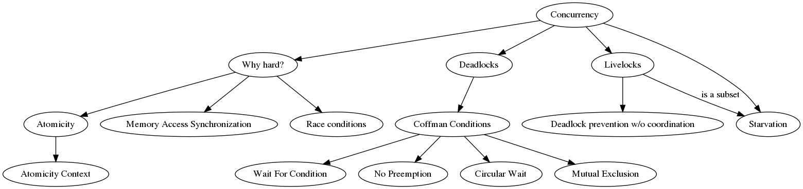

# Notes Concurrency in Go

In six chapters building block, patterns, scaling issues and internals are discussed.

## Intro

It's hard.

## Modeling

## Building blocks

## Patterns

## Scale

## Internals

