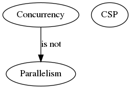

# Notes Concurrency in Go

In six chapters building block, patterns, scaling issues and internals are discussed.

## 1 Intro

It's hard.

### Coffman Conditions

If at least one of the conditions is not true, we can *prevent* deadlocks (but
it's hard to reason about code).

### Livelocks

Busy, no progress (two or more process attempt preventing a deadlock without
coordination). Subset of Starvation.

### Starvation

One or more greedy process. Livelock a special case, since no process makes
progress. Example: polite worker, keep critical section short.

### Is it safe?

Reduce API ambiguity, be explicit or do not expose concurrency at all.

### Simplicity in the Face of Complexity

> with Go’s concurrency primitives, you can more safely and clearly express
your concurrent algorithms.

[Understanding Real-World Concurrency Bugs in
Go](https://songlh.github.io/paper/go-study.pdf) suggested otherwise, no?

## 2 Modeling

### Concurrency != Parallelism

> Concurrency is a property of the code; parallelism is a property of the
> running program.

* code **is** not parallel &mdash; we hope it will **run** in parallel

> If you wanted to write concurrent code, you would model your program in terms
> of threads and synchronize the access to the memory between them.

### What is CSP?

* 1978
* input and output are overlooked properties of (concurrent) programs
* process calculus

A process requires input to run. Other processed might consume output.

### How does it help?

Goroutines may help shift thinking about *parallelism* to thinking about
*concurrency*.

What would a few questions be, if you would need to implement a web server with
threads?

* language support
* design, thread boundaries
* optimal number for a pool

> If we step back and think about the natural problem, we could state it as such:
individual users are connecting to my endpoint and opening a session.  The
session should field their request and return a response. In Go, we can almost
directly represent the natural state of this problem in code: we would create a
goroutine for each incoming connection, field the request there (potentially
communicating with other goroutines for data/services), and then return from
the goroutine's function. How we naturally think about the problem maps
directly to the natural way to code things in Go.

Side effect, separation of concerns.

> A more natural mapping to the problem space is an enormous benefit, but it
> has a few beneficial side effects as well. Go's runtime multiplexes
> goroutines onto OS threads automatically and manages their scheduling for us.
> This means that optimizations to the runtime can be made without us having to
> change how we’ve modeled our prob‐ lem; this is classic separation of
> concerns.

More composable.

> Channels, for instance, are inherently composable with other channels. This
> makes writing large systems simpler because you can coordinate the input from
> multiple subsystems by easily composing the output together. You can combine
> input channels with timeouts, cancellations, or messages to other subsystems.
> Coordinating mutexes is a much more difficult proposition.

The `select` statement help composition.

### Go Approach

* support CSP and classic style (locks, pool, ...)

[So which should you use?](https://github.com/golang/go/wiki/MutexOrChannel)

> Use whichever is most expressive and/or most simple.

## 3 Building blocks

## 4 Patterns

## 5 Scale

## 6 Internals

